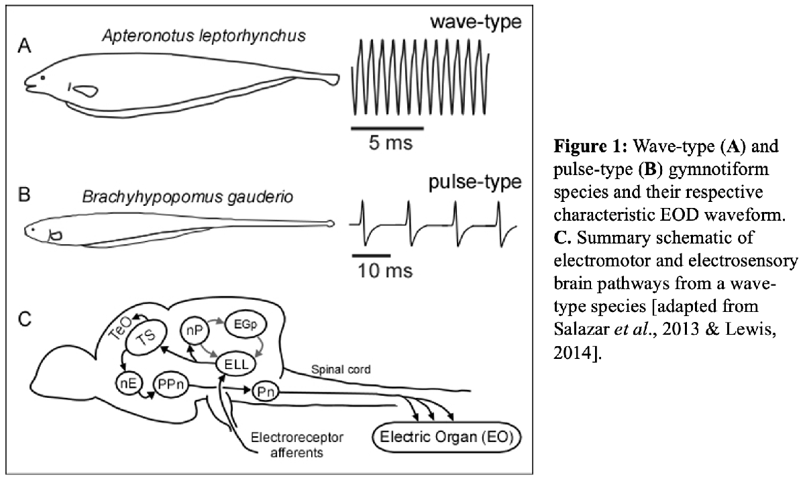

```{r setup, include=FALSE}
knitr::opts_chunk$set(echo = TRUE)
defaultW <- getOption("warn")
library(ggplot2)
library(pracma)
library(tuneR)
library(signal)
```

# **WEF module:** EODs, AMs, and Envelopes

version 15May2022

------------------------------------------------------------------------

# Introduction

Freshwater weakly electric fish evolved independently in South & Central America (the Gymnotiformes) and in Africa (the Mormyroids), with more than 200 species currently identified in each clade. Gymnotiform and mormyroid fishes generate an electric field (electrogenesis) through a specialized electric organ (**EO**).

The electric organ discharges (**EODs**) are used in social communication and for sensing the animal's environment. The self-generated EOD is detected by an array of electroreceptors on the skin (electroreception). The fish actively senses distortions to their own EOD caused by nearby objects and the EODs of other fish.



Each species of weakly electric fish produces a weak (\<100 mV/cm) electric field with a characteristic EOD waveform.

These waveforms come in two broad classes, wave-type and pulse-type. Wave-type species produce continuous, nearly sinusoidal EODs that range in frequency from less than 100 Hz to more than 2000 Hz (Fig. 1A). Pulse-type species produce short duration pulses, on the order of a few milliseconds to less than 1 millisecond, with interpulse intervals that can range from 10 milliseconds to well over 100 milliseconds (Fig. 1B).

The EOD waveform and frequency are controlled by an 'electromotor pathway' (Fig. 1C). Action potentials generated by the EO cells (electrocytes) are the fundamental building blocks of the EOD. The near-simultaneous action potentials of a thousand or more electrocytes determine EOD waveform characteristics that can be species, sex, and individually distinct. The EOD frequency (EODf) is controlled by the medullary pacemaker nucleus (Pn), the electrogenic motor command center. The Pn directs the activity of the spinal electromotor neurons, which innervate the electrocytes. The Pn receives inputs from the prepacemaker nuclei (PPn), which modulate EOD frequency.

In this NS&B module, we focus on the electrosensory pathway of wave-type species (Fig. 1C). This electrosensory pathway begins with specialized tuberous electroreceptors that sense spatiotemporal modulations of the fish's own EOD and send this information via primary afferents (EAs) to the hindbrain electrosensory lateral line lobe (ELL). The ELL pyramidal neurons (P-Cells) project to the torus semicircularis (Ts), which then projects to the optic tectum (TeO). The ELL P-Cells also project to the nucleus praeeminentialis (nP), which in turn drives feedback to the ELL, either directly or indirectly via the eminentia granularis posterior (EGp). Although there are multiple pathways for electro-sensory-motor integration, the most direct pathway connects the TS to the PPn via the nucleus electrosensorius (nE).

------------------------------------------------------------------------

# Electric communication signals

When weakly electric fish are in close proximity, their electric fields mix, which results in patterns of interference that can be perceived by each of the fish. Fish can extract information about conspecifics from the interference pattern, and often the fish will respond with specialized modulations of their own electric field (e.g., jamming avoidance response, chirps, gradual rises, etc.). Sometimes the patterns of interference will impair the fish's ability to locate objects in its environment such as prey. In these cases, the fish will shift their EOD frequency away from each other to avoid the interference, a behavior known as Jamming Avoidance Response (JAR). You will use the electrosensory stimuli described below mimic different behavioral conditions.

[**This is the point of this tutorial: What are the patterns of interference, and how do we compute and plot them?**]{.underline}

**Section A:** We make 2 sinewaves - **EOD signals for each fish**.

**Section B:** We add those sinewaves together - similar to **two stationary fish**. [dF is the difference in frequencies]

**Section C:** We multiply a carrier wave (e.g. the EOD of one fish) by a sinewave at a dF to generate **AMs**.

**Section D:** What happens when we have more than 2 fish - **several stationary fish**.

**Section E:** A computational way to simulate an **infinite number of stationary fish** via AMs.

**Section F:** What happens when fish move relative to each other? **They generate envelopes.**

## A) Individual fish EOD/sinewave frequencies

Change the frequencies of the individual fish (S1f and S2f) to see how the following signals interact.

```{r Sinewaves, warning = FALSE}
windowidth = 0.15 ### SET THIS FOR WIDTH OF PLOT in seconds

# You can alter any of the following parameters:
Fs = 20000 # Sample rate [Default = 20000]
EndTime = 2 # Length of signals in seconds [Default = 2]

S1f = 250 # Frequency in Hz of first fish [Default = 250; between 200 and 1000 Hz]
S2f = 260 # Frequency in Hz of second fish [Default = S1f +10]

# Make a time sequence (tim)
intvl = 1/Fs # Each time increment, aka time intervals between samples
tim = seq(intvl, EndTime, intvl)

# Make the sinewaves
S1 = sin(tim*S1f*2*pi) # Fish #1 - 250 Hz
S2 = sin(tim*S2f*2*pi) * 0.8 # Fish #2 - 260 Hz and 80% of amplitude of fish #1

# Assemble into dataframe for plots
  plotBeat = data.frame(tim, S1, S2) 
  
# Plot raw signals
ggplot(data=plotBeat) +
  geom_line(colour = "Blue", show.legend = FALSE, aes(x = tim, y = S1)) +
  geom_line(colour = "Magenta", show.legend = FALSE, aes(x = tim, y = S2)) +
  xlab("Time") +
  ylab("Sinewaves") +
  ggtitle("Two EOD signals") +
  xlim(0, windowidth)

```

## B) Two fish make 'Beats'

When two wave-type fish are close to one another (e.g., during courtship or agonistic situation), their electric fields sum. As happens whenever you add two sinewaves, the ampltiude will change as the two signals go in and out of phase with each other. This change in amplitude is known as an amplitude modulation (AM). In addition, there is a relative change in phase which is known as phase modulation (PM). The rate of the AMs and PMs is equal to the frequency difference between the two sinewaves. The frequency difference is commonly called the dF.

```{r BeatPlots, echo=FALSE, warning = FALSE}
windowidth = 0.15 ### SET THIS FOR WIDTH OF PLOT in seconds

# Lets add the two EOD sinewave signals
  ss = S1 + S2

  # To plot the 'envelope', we will take the peak amplitudes 
    ass <- abs(ss) # absolute value gives us twice as many positive peaks
    peaks <- findpeaks(ass, minpeakdistance = 10) # function gets the peaks
      peaktims = tim[peaks[,2]] # Extract the tims when the peaks occurred
      peakamps = ass[peaks[,2]] # Get the amplitudes of the peaks

# Assemble into dataframe for plots
  plotPeaks = data.frame(peaktims, peakamps)
  
# Plot summed signal and amplitude envelope
ggplot() +
  geom_line(data=plotBeat, colour = "Black", show.legend = FALSE, aes(x = tim, y = ss)) +
  geom_line(data=plotPeaks, colour = "Red", show.legend = FALSE, aes(x = peaktims, y = peakamps)) +
  geom_point(data=plotPeaks, colour = "Red", show.legend = FALSE, aes(x = peaktims, y = peakamps), size = 1) +
  xlab("Time") +
  ggtitle("Summed signal and beat - AMs and PMs") +
  xlim(0, windowidth)
  

```

------------------------------------------------------------------------

## C) Sinusoidal amplitude modulations (SAMs) are similar to beats

Sinusoidal amplitude modulations (SAM) are meant to mimic the AMs that emerge when two fish are near each other. Instead of adding two sinewaves, we can multiply a single sinewave with a modulatory signal, such as another sinewave. We can imitate the AMs (but not PMs) generated when two fish are near each other by multiplying one fish's EOD with a sinewave equal to the dF. situation where two wave-type fish are close to one another (e.g., during courtship or agonistic situation). As seen in the introductory lecture, each fish will experience a SAM of its own EOD (i.e., a beat). The beat frequency can range from a few Hz to 400 Hz. Each fish's EOD frequency and the sum are illustrated by running the code below.

```{r AMplots, echo=FALSE, warning=FALSE}
windowidth = 0.15 ### SET THIS FOR WIDTH OF PLOT in seconds

# The frequency of the SAM will be the dF of S1 and S2
  samFreq <- abs(S1f-S2f) 
  
# Make the SAM sinewave (matches beat above)  
    sam = 0.5 + (cos(samFreq*2*pi*tim) * 0.4) # We use 'cos' so that phase matches figure(1)
# Multiply the carrier (original sinewave) by the sinusoidal amplitude modulation (sam)
    S1AM = S1 * sam
    
# Assemble into dataframe for plots
    plotSAM = data.frame(tim, S1, sam, S1AM)

par(mfrow = c(2,1)) # Two rows of plots

ggplot(data=plotSAM) +
  geom_line(colour = "Blue", show.legend = FALSE, aes(x = tim, y = S1)) +
  geom_line(colour = "Magenta", show.legend = FALSE, aes(x = tim, y = sam)) +
  xlab("Time") +
  ggtitle("Signal and AM") +
  xlim(0, windowidth)

ggplot(data=plotSAM) +
  geom_line(colour = "Black", show.legend = FALSE, aes(x = tim, y = S1AM)) +
  geom_line(colour = "red", show.legend = FALSE, aes(x = tim, y = sam)) +
  xlab("Time") +
  ggtitle("Modulated signal") +
  xlim(0, windowidth)

```

------------------------------------------------------------------------

## D) Sum of Sines (more than two fish)

Now imagine that there are more than two fish. The interactions between the various sinewaves of the fish in the group can make for a complex, often seemingly unpredictable signal.

To simulate this situation, we can add the sinewaves of multiple fish at different EOD frequencies - as happens in nature. Or (as we've just learned) we can multiply S1 signal by an AM signal. In this case, the AM signal would be a sum of all the dFs between each of the fish in this artificial group.

Sum of sines signals can be desinged to appear random to the fish as long as they avoid integer common multiples in the dFs. Such a pseudorandom signal is composed of discrete frequencies that enables us to analyze the response with respect to each frequency indpendently.

```{r SumOfSineplots, echo=FALSE, warning=FALSE}
windowidth = 0.25 ### SET THIS FOR WIDTH OF PLOT in seconds

# SUM OF SINES SIGNALS    
# Put a list of other fish frequencies.  I reccomend only 3 or 4 for this demonstration
    otherFreqs = c(255.55, 269.21, 292.03) # A list of other fish frequencies

    # Having the frequencies sorted in ascending order makes a computation below easier.    
      otherFreqs = sort(otherFreqs) 

# Make the signal by adding each of the sinewaves together
  SoSreal = S1; # The original fish's own signal

# Add each of the other sinewaves to the fish's original sinewave
        for (j in 1:length(otherFreqs)) {
            SoSreal = SoSreal + sin(2*pi*tim*otherFreqs[j]); 
        }
# Get the peaks so that we can visualize the amplitude modulation
    SoSrealabs = abs(SoSreal) # Taking the absolute value doubles the positive peaks
    sspeaks <- findpeaks(SoSrealabs, minpeakdistance = 10) # Get the peaks
      sspeaktims = tim[sspeaks[,2]] # Use the indices to get the times of the peaks
      sspeakamps = SoSrealabs[sspeaks[,2]] # same for the amplitudes
      
# Assemble into dataframe for plots
  plotSoS = data.frame(tim, SoSreal)
  plotSoSPeaks = data.frame(sspeaktims, sspeakamps)
  
par(mfrow = c(2,1)) # Two rows of plots

ggplot() +
  geom_line(data=plotSoS, colour = "Black", show.legend = FALSE, aes(x = tim, y = SoSreal)) +
  geom_line(data=plotSoSPeaks, colour = "Red", show.legend = FALSE, aes(x = sspeaktims, y = sspeakamps)) +
  geom_point(data=plotSoSPeaks, colour = "Red", show.legend = FALSE, aes(x = sspeaktims, y = sspeakamps), size = 1) +
  xlab("Time") +
  ggtitle("Sum of Sines signal by adding EODs") +
  xlim(0, windowidth)           

# Make the signal by multiplying by all of the difference frequencies

# Get the 'dFs' - the differences in frequencies between fish

        # The difference of each fish to the first fish
        dFFreqs = otherFreqs - S1f 

        # CRITICALLY, we need to get the dFs between all of the other fish
        # The difference of each new fish (ascending order) with each other
        dFFreqs = c(dFFreqs, diff(otherFreqs)) 

        # If three fish, then we missed the difference between first and last fish (1-3)
        if (length(otherFreqs) >= 3){ 
            dFFreqs = c(dFFreqs, otherFreqs[1]-otherFreqs[3])
        }
        # If four fish, then we also missed 1-4 and 2-4
        if (length(otherFreqs) >= 4){ 
            dFFreqs = c(FFreqs, otherFreqs[1]-otherFreqs[4], otherFreqs[2]-otherFreqs[4])
        }
        # Not bothering to do any more than 4 fishies...
        if (length(otherFreqs) > 4){ 
            fprintf('The plots will not match properly due to missing dFs.\n')
        }

        # Calculate the dF signal that we will multiply to the carrier (the S1)
        SoSmult = numeric(length(tim)) # a list of zeros to start
        for (j in 1:length(dFFreqs)){ # Add each frequency to the zeros we just made         
            SoSmult = SoSmult + (1 + cos(2*pi*tim*dFFreqs[j])); 
        }
        
        # Scale SoSmult from 0 to 1
        SoSmult = SoSmult - min(SoSmult)
        SoSmult = SoSmult / max(SoSmult)        

# Multiply the AM to the carrier signal, the S1                
SoS1 = S1 * SoSmult

# Make a data frame for plotting        
      plotSoSm = data.frame(tim, SoS1, SoSmult)

ggplot(data=plotSoSm) +
  geom_line(colour = "Black", show.legend = FALSE, aes(x = tim, y = SoS1)) +
  geom_line(colour = "Red", show.legend = FALSE, aes(x = tim, y = SoSmult)) +
  xlab("Time") +
  ggtitle("SoS AM by multiplication") +
  xlim(0, windowidth)          

```

------------------------------------------------------------------------

## E) Random amplitude modulations (RAMs)

RAMs are meant to mimic the situation where many (infinite number!) fish are close to one another (e.g., a group of fish all in close proximity to one another). A random signal is a useful tool from a computational point of view.

```{r RAMs, echo=FALSE, warning=FALSE}
    windowidth = 0.20 ### SET THIS FOR WIDTH OF PLOT in seconds

# We will generate a filtered noise AM modulated EOD signal.

# Generate noisy signal (random)
        RandomSignal = rand(m=1, n=length(S1)) # Use rand to make a random signal

# Filter the signal    
    RR = 100 # Low-Pass cutoff frequency
    # We love butter
        bf <- butter(3, RR/(Fs/2), c("low"))

        # Filter the signal to have the frequency range we want - top frequency
        # specified by RR
        RandomSignal = filtfilt(bf, RandomSignal) 

        # Scale the random signal to range from 0 to 1    
        RandomSignal = RandomSignal - min(RandomSignal)
        RandomSignal = RandomSignal / max(RandomSignal)
        
# Multiply the carrier (S1) with the AM signal
    RAM = S1 * RandomSignal
        
plotRand = data.frame(tim, S1, RandomSignal, RAM)  

par(mfrow = c(2,1)) # Two rows of plots

ggplot(data=plotRand) +
  geom_line(colour = "Blue", show.legend = FALSE, aes(x = tim, y = S1)) +
  geom_line(colour = "Magenta", show.legend = FALSE, aes(x = tim, y = RandomSignal)) +
  xlab("Time") +
  ggtitle("Signal and AM") +
  xlim(0, windowidth)

ggplot(data=plotRand) +
  geom_line(colour = "Black", show.legend = FALSE, aes(x = tim, y = RAM)) +
  geom_line(colour = "Red", show.legend = FALSE, aes(x = tim, y = RandomSignal)) +
  xlab("Time") +
  ggtitle("Signal and AM") +
  xlim(0, windowidth)

```

## F) Moving fish (envelopes!)

Fish routinely move, and this has an effect on the relative amplitude of the EOD perceived by the other fish. Like sound, as the source moves farther away, the amplitude decreases. For sound the decrease is roughly \^2 whereas for electricity in water it the decrease is roughly \^3.

We will simulate the second fish moving relative to the first fish.

The result is remarkable: the dF appears in the AM (red), and the movement frequency appears in the envelope of the AM (green).

```{r Envelopes, echo=FALSE, warning=FALSE}
    windowidth = 2 ### SET THIS FOR WIDTH OF PLOT in seconds

# Movement frequency (envelope frequency) in Hz. [Default = 0.5]
    S2movementfreq = 0.6; 
    
# Make an AM modulation at that frequency. The +0.6 is attenuation due to distance
    S2distance = (sin(tim*2*pi*S2movementfreq)/3) + 0.6

# AM modulate the S2 - this is similar to the S2 fish moving relative the the S1 fish
    movingS2 = S2 * S2distance    
        
# Add S1 and moving S2 together.  This is what the S1 fish will detect.
    comboEnv = S1 + movingS2

    # Calculate the AM and the Envelope
    # Calculate the AM
    amovingS2 = abs(comboEnv) # Taking the absolute value doubles the positive peaks
    AMpeaks <- findpeaks(amovingS2, minpeakdistance = 2) # Get the peaks
      AMpeaktims = tim[AMpeaks[,2]] # Use the indices to get the times of the peaks
      AMpeakamps = amovingS2[AMpeaks[,2]] # same for the amplitudes
      
    # Calculate the AM of the AM, which is the envelope
       # Annoyingly, data from findpeaks are not sorted, which is ANNOYING
        sortedAMpeaktims <- AMpeaktims[order(AMpeaktims)]
        sortedAMpeakamps <- AMpeakamps[order(AMpeaktims)]
      
    ENVpeaks <- findpeaks(sortedAMpeakamps, minpeakdistance = 2)
      ENVpeaktims = sortedAMpeaktims[ENVpeaks[,2]]
      ENVpeakamps = sortedAMpeakamps[ENVpeaks[,2]]

# Make data frames for plotting      
  plotMov = data.frame(tim, S1, movingS2, comboEnv)        
  plotMovAM = data.frame(AMpeaktims, AMpeakamps)        
  plotMovENV = data.frame(ENVpeaktims,ENVpeakamps)        
        
par(mfrow = c(3,1)) # Three rows of plots

ggplot(data=plotMov) +
  geom_line(colour = "Blue", show.legend = FALSE, aes(x = tim, y = S1)) +
  xlab("Time") +
  ggtitle("EOD of S1 fish - zoom in to see sinewave") +
  xlim(0, windowidth)

ggplot(data=plotMov) +
  geom_line(colour = "Blue", show.legend = FALSE, aes(x = tim, y = movingS2)) +
  xlab("Time") +
  ggtitle("EOD of S2 fish - changes in amplitude in relation to distance") +
  xlim(0, windowidth)

ggplot() +
  geom_line(data=plotMov, colour = "Black", show.legend = FALSE, aes(x = tim, y = comboEnv)) +
  geom_point(data=plotMovAM, colour = "Red", show.legend = FALSE, aes(x = AMpeaktims, y = AMpeakamps), size = 0.5) +
  geom_line(data=plotMovENV, colour = "Green", show.legend = FALSE, aes(x = ENVpeaktims, y = ENVpeakamps)) +
  geom_point(data=plotMovENV, colour = "Green", show.legend = FALSE, aes(x = ENVpeaktims, y = ENVpeakamps), size = 1) +
  xlab("Time") +
  ggtitle("Sum of S1 and S2 (black) with AM (red) and Envelope (green)") +
  xlim(0, windowidth)

```

## G) Contrast modulated SAMs (simulated Envelopes)

As before, we can modulate the S1 by multiplication to simulate the natural envelopes. A simple way to mimic this is to give a SAM whose contrast varies dynamically in time. We'll thus be giving a contrast modulated SAM.

Again, multiplication has no effect on phase, only amplitude.

```{r simEnvelopes, echo=FALSE, warning=FALSE}
    par(mfrow = c(2,1)) # Two rows of plots
    windowidth = 2.0 ### SET THIS FOR WIDTH OF PLOT in seconds
    
# Take the AM signal from above 'sam'
# multiply it by the movement frequency
  Env = sam * S2distance
  Env = Env / max(Env)

  simEnv = S1 * Env

# Assemble into dataframe for plots
    plotSIMENV = data.frame(tim, S1, S2distance, Env, simEnv)

ggplot(data=plotSIMENV) +
  geom_line(colour = "Blue", show.legend = FALSE, aes(x = tim, y = S1)) +
  geom_line(colour = "Magenta", show.legend = FALSE, aes(x = tim, y = Env)) +
  xlab("Time") +
  ggtitle("EOD (blue) and contrast modulation (magenta). zoom in to see sinewave") +
  xlim(0, windowidth)

ggplot(data=plotSIMENV) +
  geom_line(colour = "Black", show.legend = FALSE, aes(x = tim, y = simEnv)) +
  geom_line(colour = "Red", show.legend = FALSE, aes(x = tim, y = Env)) +
  geom_line(colour = "Green", show.legend = FALSE, aes(x = tim, y = S2distance)) +
  xlab("Time") +
  ggtitle("Product (black), contrast modulated SAM (red), and envelope (green)") +
  xlim(0, windowidth)

```

# Why (thrice)?

## 1) Why all of these signals (EODs, AMs, Envelopes)?

The fish respond to each of these signals, processing them simultaneously in sensory circuits. In other words - they are each biologically relevant!

## 2) Why the two methods - adding and multiplying?

We use these methods in different experimental circumstances for experimental control. For example, in Eigenmannia, the EOD is blocked and we replace it with an artificial S1 sinewave signal - for these fish we add signals. In contrast, in Apteronotus the EOD persists and we produce an amplitude-modulated signal that is time locked to the fish's own EOD. This is complicated to describe - easier to demonstrate in the experimental rig.

## 3) Why Random signals?

It is a 1) way to assess linearity (compare single sines to random sines) and 2) allows us to use a broader array of analytic techiques including spike triggered averaging (for example).
