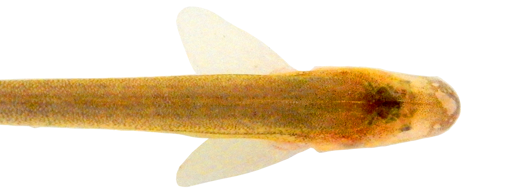
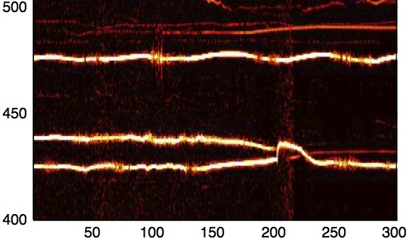
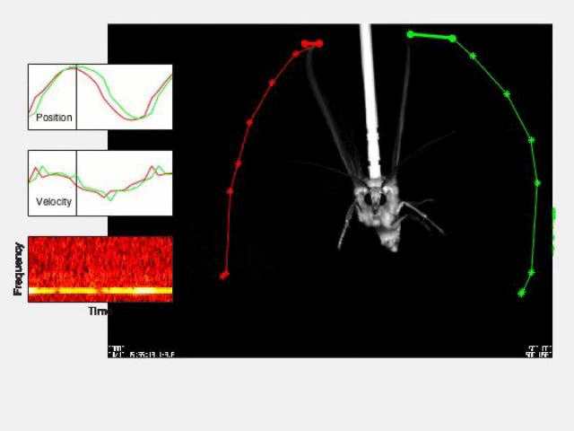
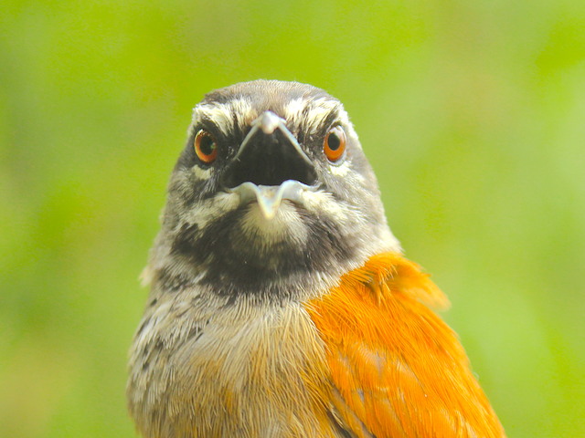

---
---

<!-- <body style="background-image:url(images/header-bg.png); background-position: left bottom; background-repeat: no-repeat; background-size: contain;"> -->

<link rel="stylesheet" href="styles.css" type="text/css">

<table width=100% cellspacing=30 cellpadding=30 border=0 columns=1><tr><td>
<h1 class="display-3" align="center">Fortune Laboratory Industries</h1>
</td></tr><tr><td></table>

<h1 class="display-3" align="center"> </h1></td></tr></table>

 

Students in my laboratory study the interactions between sensory and motor
systems that generate and control animal behavior. Experiments in
the lab focus on two main questions:   

<table width=90% cellspacing=5 cellpadding=5 border=0 columns=1><tr><td align=middle valign=center>

<strong>How do the brains of animals interact to control social interactions?</strong>

</td></tr><tr><td align=middle valign=center>

<strong>How do animals use sensory feedback for locomotor control?</strong>

</td></tr></table>

We use approaches that cross levels of biological
organization from the computational consequences of transmembrane molecules to
the behavior of multispecies flocks. 

Our work includes field studies of natural behavior in Amazon
basin habitats, highly-controlled behavioral studies in the laboratory, a
variety of neurophysiological approaches including intracellular recordings of
CNS neurons in behaving animals, pharmachological studies, and mathematical
modeling. 

<h2 class="display-3" align="center">Projects</h2>

&nbsp;

<table width=90% border=0 columns=2 align=center>

<tr><td width=45% align=center valign=middle style="padding: 20px; border: 1px solid black;">

What are the neural mechanisms that govern social interactions in weakly electric fishes?
</td>
<td width=45% align=center valign=middle style="padding: 20px; border: 1px solid black;">

How do animals use multisensory feedback for the control of locomotion?
</td></tr>

<tr><td width=45% align=center valign=middle style="padding: 20px; border: 1px solid black;">

How do moths avoid being eaten by echolocating bats?
</td>
<td width=45% align=center valign=middle style="padding: 20px; border: 1px solid black;">

How do animals control cooperative behaviors?
</td></tr>

</table>

