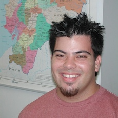
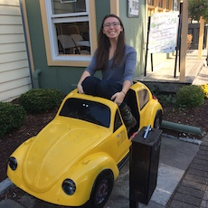

---
---
<link rel="stylesheet" href="styles.css" type="text/css">

<h1 class="display-3" align="center">Laboratory Humans</h1>

<!-- ERIC FORTUNE -->
<table align="center" columns=2 cellspacing=2 cellpadding=5 border=0 width=80%>
<tr><td colspan=1 style="padding: 10px; border: 0px none;" align="center" valign="middle">

</td>
<td colspan=1 style="padding: 10px; border: 0px none;" align="center" valign="middle">
<h3 class="display-3" align="center">Eric Fortune PhD</h3>

Old man in charge 
[eric.fortune@njit.edu](mailto:eric.fortune@njit.edu)

</td></tr></table>

<!-- ISMAIL UYANIK -->
<table align="center" columns=2 cellspacing=2 cellpadding=5 border=0 width=80%>

<tr><td colspan=1 style="padding: 10px; border: 0px none;" align="center" valign="top">

<h3 class="display-3" align="center">Ismail Uyanik PhD</h3>

Post-doctoral fellow 
</td>

<!-- KATIE GALLMAN -->
<td colspan=1 style="padding: 10px; border: 0px none;" align="center" valign="top">

<h3 class="display-3" align="center">Kathryn Gallman</h3>

Graduate Student (Dr. Soares) 
</td>
</tr></table>

<!-- YASMINE GHATTAS -->
<table align="center" columns=2 cellspacing=2 cellpadding=5 border=0 width=80%>

<tr><td colspan=1 style="padding: 10px; border: 0px none;" align="center" valign="top">

<h3 class="display-3" align="center">Yasmine Ghattas</h3>

Undergraduate student 
</td>

<!-- Alfred Amendolara -->

<td colspan=1 style="padding: 10px; border: 0px none;" align="center" valign="top">

<h3 class="display-3" align="center">Alfred Amendolara</h3>

Masters student 
</td>
</tr></table>

<h1 class="display-3" align="center">Collaborators</h1>

<!-- Maurice Chacron -->
<table align="center" columns=2 cellspacing=2 cellpadding=5 border=0 width=80%>
<tr><td colspan=1 style="padding: 10px; border: 0px none;" align="center" valign="middle">

</td>
<td colspan=1 style="padding: 10px; border: 0px none;" align="center" valign="middle">
<h3 class="display-3" align="center">Maurice Chacron PhD</h3>

Professor, [McGill University](https://mcgill.ca/comp-sys-neuro-lab/research) 

</td></tr></table>

<!-- Melissa Coleman -->
<table align="center" columns=2 cellspacing=2 cellpadding=5 border=0 width=80%>
<tr><td colspan=1 style="padding: 10px; border: 0px none;" align="center" valign="middle">

</td>
<td colspan=1 style="padding: 10px; border: 0px none;" align="center" valign="middle">
<h3 class="display-3" align="center">Melissa Coleman PhD</h3>

Associate Professor,  [Claremont McKenna College](https://www.cmc.edu/academic/faculty/profile/melissa-coleman) 

</td></tr></table>

<!-- Noah Cowan -->
<table align="center" columns=2 cellspacing=2 cellpadding=5 border=0 width=80%>
<tr><td colspan=1 style="padding: 10px; border: 0px none;" align="center" valign="middle">

</td>
<td colspan=1 style="padding: 10px; border: 0px none;" align="center" valign="middle">
<h3 class="display-3" align="center">Noah Cowan PhD</h3>

Professor, [Johns Hopkins University](https://limbs.lcsr.jhu.edu/) 

</td></tr></table>

<h1 class="display-3" align="center">Lab Memories</h1>

<!-- Eric Tan -->
<table align="center" columns=2 cellspacing=2 cellpadding=5 border=0 width=80%>

<tr><td colspan=1 style="padding: 10px; border: 0px none;" align="center" valign="top">

<h3 class="display-3" align="center">Eric Tan MD</h3>

Assistant Professor,  [University of Southern California](https://providers.keckmedicine.org/provider/Eric+W.+Tan/205713) 
</td>

<!-- Jonathan Nizar -->
<td colspan=1 style="padding: 10px; border: 0px none;" align="center" valign="top">

<h3 class="display-3" align="center">Jonathan Nizar MD</h3>

Assistant Professor, [University of Iowa](https://medicine.uiowa.edu/internalmedicine/profile/jonathan-nizar) 
</td></tr></table>

<!-- Sarah Stamper PhD -->
<table align="center" columns=2 cellspacing=2 cellpadding=5 border=0 width=80%>

<tr><td colspan=1 style="padding: 10px; border: 0px none;" align="center" valign="top">

<h3 class="display-3" align="center">Sarah A. Stamper PhD</h3>

Associate Director of Research,  [Art and Science Group](https://www.artsci.com/team/sarah-stamper) 
</td>

<!-- John U. Ramcharitar PhD -->
<td colspan=1 style="padding: 10px; border: 0px none;" align="center" valign="top">

<h3 class="display-3" align="center">John U. Ramcharitar PhD</h3>

Associate Professor,  [University of Trinidad and Tobago](https://utt.edu.tt/index.php?wk=5&staff=1&staff_key=2833) 
</td></tr></table>

<!-- Sean G. Carver PhD -->
<table align="center" columns=2 cellspacing=2 cellpadding=5 border=0 width=80%>

<tr><td colspan=1 style="padding: 10px; border: 0px none;" align="center" valign="top">

<h3 class="display-3" align="center">Sean G. Carver PhD</h3>

Assistant Professor,  [American University](https://www.american.edu/cas/faculty/carver.cfm) 
</td>

<!-- Diana Pamela Rivera Parra -->
<td colspan=1 style="padding: 10px; border: 0px none;" align="center" valign="top">

<h3 class="display-3" align="center">Pamela Rivera Parra MSc</h3>

Assistant Professor,  [Escuela Polit&eacute;cnica Nacional](https://www.epn.edu.ec/) 
</td></tr></table>

<!-- Monica Khattak -->
<table align="center" columns=2 cellspacing=2 cellpadding=5 border=0 width=80%>

<tr><td colspan=1 style="padding: 10px; border: 0px none;" align="center" valign="top">

<h3 class="display-3" align="center">Monica Khattak</h3>

Medical Student,  [Rowan School of Medicine](https://www.linkedin.com/in/monica-khattak-a4b9b593) 
</td>

<!-- Andrea Roeser -->
<td colspan=1 style="padding: 10px; border: 0px none;" align="center" valign="top">

<h3 class="display-3" align="center">Andrea Roeser</h3>

Graduate Student,  [Cornell University](https://nbb.cornell.edu/andrea-roeser) 
</td></tr></table>

<!-- Hannah Gattuso -->
<table align="center" columns=2 cellspacing=2 cellpadding=5 border=0 width=80%>

<tr><td colspan=1 style="padding: 10px; border: 0px none;" align="center" valign="top">

<h3 class="display-3" align="center">Hannah Gattuso</h3>

Graduate Student,  [New York University](https://www.linkedin.com/in/hannah-gattuso-35b25a139) 
</td>

<!-- David Liptsyn -->
<td colspan=1 style="padding: 10px; border: 0px none;" align="center" valign="top">

<h3 class="display-3" align="center">David Liptsyn</h3>

Intern, [Tesla](https://www.linkedin.com/in/davidliptsyn) 
</td></tr></table>

<!-- Nicole Andanar -->
<table align="center" columns=2 cellspacing=2 cellpadding=5 border=0 width=80%>

<tr><td colspan=1 style="padding: 10px; border: 0px none;" align="center" valign="top">

<h3 class="display-3" align="center">Nicole Andanar</h3>

Chemical Researcher, [Battelle](https://www.linkedin.com/in/nicoleandanar) 
</td>

<!-- Oswaldo Gil -->
<td colspan=1 style="padding: 10px; border: 0px none;" align="center" valign="top">

<h3 class="display-3" align="center">Oswaldo Gil</h3>

Graduate Student,  [Universidad del Rosario](https://www.linkedin.com/in/oswaldogilguevara) 
</td></tr></table>

And many others...

