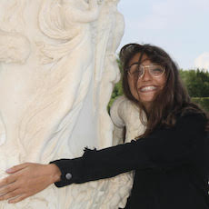
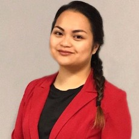

---
---
<link rel="stylesheet" href="styles.css" type="text/css">

<h1 class="display-3" align="center">Laboratory Humans</h1>

<!-- ERIC FORTUNE -->
<table align="center" columns=2 cellspacing=2 cellpadding=5 border=0 width=80%>
<tr><td colspan=1 width=300>

</td><td valign="middle" align="center">
<strong>Eric Fortune PhD</strong>

Old man in charge 
[eric.fortune@njit.edu](mailto:eric.fortune@njit.edu)
</td></tr></table>

<!-- ISMAIL UYANIK -->
<table align="center" columns=2 cellspacing=2 cellpadding=5 border=0 width=80%>
<tr><td colspan=1 width=300>

</td><td valign="middle" align="center">
<strong>Ismail Uyanik PhD</strong>

Post-doctoral fellow 
</td></tr></table>

<!-- KATIE GALLMAN -->
<table align="center" columns=2 cellspacing=2 cellpadding=5 border=0 width=80%>
<tr><td colspan=1 width=300>

</td><td valign="middle" align="center">
<strong>Kathryn Gallman</strong>

Graduate Student (Dr. Soares) 
</td></tr></table>

<!-- YASMINE GHATTAS -->
<table align="center" columns=2 cellspacing=2 cellpadding=5 border=0 width=80%>
<tr><td colspan=1 width=300>

</td><td valign="middle" align="center" >
<strong>Yasmine Ghattas</strong>

Undergraduate student 
</td></tr></table>

<!-- Alfred Amendolara -->
<table align="center" columns=2 cellspacing=2 cellpadding=5 border=0 width=80%>
<tr><td colspan=1 width=300>

</td><td valign="middle" align="center" >
<strong>Alfred Amendolara</strong>

Masters student 
</td></tr></table>

<h1 class="display-3" align="center">Collaborators</h1>

<!-- Maurice Chacron -->
<table align="center" columns=2 cellspacing=2 cellpadding=5 border=0 width=80%>
<tr><td colspan=1 width=300>

</td><td valign="middle" align="center" >
<strong>Maurice Chacron PhD</strong>

Professor, [McGill University](http://www.medicine.mcgill.ca/physio/chacronlab/default.htm) 
</td></tr></table>

<!-- Melissa Coleman -->
<table align="center" columns=2 cellspacing=2 cellpadding=5 border=0 width=80%>
<tr><td colspan=1 width=300>

</td><td valign="middle" align="center" >
<strong>Melissa Coleman PhD</strong>

Associate Professor, [Claremont McKenna College](https://www.cmc.edu/academic/faculty/profile/melissa-coleman) 
</td></tr></table>

<!-- Noah Cowan -->
<table align="center" columns=2 cellspacing=2 cellpadding=5 border=0 width=80%>
<tr><td colspan=1 width=300>

</td><td valign="middle" align="center" >
<strong>Noah Cowan PhD</strong>

Professor, [Johns Hopkins University](https://limbs.lcsr.jhu.edu/) 
</td></tr></table>

<h1 class="display-3" align="center">Lab Memories</h1>

<!-- Eric Tan -->
<table align="center" columns=2 cellspacing=2 cellpadding=5 border=0 width=80%>
<tr><td colspan=1 width=300>

</td><td valign="middle" align="center" >
<strong>Eric Tan MD</strong>

Assistant Professor, [University of Southern California](https://providers.keckmedicine.org/provider/Eric+W.+Tan/205713) 
</td></tr></table>

<!-- Jonathan Nizar -->
<table align="center" columns=2 cellspacing=2 cellpadding=5 border=0 width=80%>
<tr><td colspan=1 width=300>

</td><td valign="middle" align="center" >
<strong>Jonathan Nizar MD</strong>

Assistant Professor, [University of Iowa](https://medicine.uiowa.edu/internalmedicine/profile/jonathan-nizar) 
</td></tr></table>

<!-- Sarah Stamper PhD -->
<table align="center" columns=2 cellspacing=2 cellpadding=5 border=0 width=80%>
<tr><td colspan=1 width=300>

</td><td valign="middle" align="center" >
<strong>Sarah A. Stamper PhD</strong>

Associate Director of Research, [Art and Science Group](https://www.artsci.com/team/sarah-stamper) 
</td></tr></table>

<!-- John U. Ramcharitar PhD -->
<table align="center" columns=2 cellspacing=2 cellpadding=5 border=0 width=80%>
<tr><td colspan=1 width=300>

</td><td valign="middle" align="center" >
<strong>John U. Ramcharitar PhD</strong>

Associate Professor, [University of Trinidad and Tobago](https://utt.edu.tt/index.php?wk=5&staff=1&staff_key=2833) 
</td></tr></table>

<!-- Sean G. Carver PhD -->
<table align="center" columns=2 cellspacing=2 cellpadding=5 border=0 width=80%>
<tr><td colspan=1 width=300>

</td><td valign="middle" align="center" >
<strong>Sean G. Carver PhD</strong>

Assistant Professor, [American University](https://www.american.edu/cas/faculty/carver.cfm) 
</td></tr></table>

<!-- Diana Pamela Rivera Parra -->
<table align="center" columns=2 cellspacing=2 cellpadding=5 border=0 width=80%>
<tr><td colspan=1 width=300>

</td><td valign="middle" align="center" >
<strong>Diana Pamela Rivera Parra MSc</strong>

Assistant Professor, [Escuela Politecnica Nacional](https://www.epn.edu.ec/) 
</td></tr></table>

<!-- Monica Khattak -->
<table align="center" columns=2 cellspacing=2 cellpadding=5 border=0 width=80%>
<tr><td colspan=1 width=300>

</td><td valign="middle" align="center" >
<strong>Monica Khattak</strong>

Medical Student, [Rowan School of Medicine](https://www.linkedin.com/in/monica-khattak-a4b9b593) 
</td></tr></table>

<!-- Andrea Roeser -->
<table align="center" columns=2 cellspacing=2 cellpadding=5 border=0 width=80%>
<tr><td colspan=1 width=300>

</td><td valign="middle" align="center" >
<strong>Andrea Roeser</strong>

Graduate Student, [Cornell University](https://nbb.cornell.edu/andrea-roeser) 
</td></tr></table>

<!-- Hannah Gattuso -->
<table align="center" columns=2 cellspacing=2 cellpadding=5 border=0 width=80%>
<tr><td colspan=1 width=300>

</td><td valign="middle" align="center" >
<strong>Hannah Gattuso</strong>

Graduate Student, [New York University](https://www.linkedin.com/in/hannah-gattuso-35b25a139) 
</td></tr></table>

<!-- David Liptsyn -->
<table align="center" columns=2 cellspacing=2 cellpadding=5 border=0 width=80%>
<tr><td colspan=1 width=300>

</td><td valign="middle" align="center" >
<strong>David Liptsyn</strong>

Intern, [Tesla](https://www.linkedin.com/in/davidliptsyn) 
</td></tr></table>

<!-- Nicole Andanar -->
<table align="center" columns=2 cellspacing=2 cellpadding=5 border=0 width=80%>
<tr><td colspan=1 width=300>

</td><td valign="middle" align="center" >
<strong>Nicole Andanar</strong>

Chemical Researcher, [Battelle](https://www.linkedin.com/in/nicoleandanar) 
</td></tr></table>

<!-- Oswaldo Gil -->
<table align="center" columns=2 cellspacing=2 cellpadding=5 border=0 width=80%>
<tr><td colspan=1 width=300>

</td><td valign="middle" align="center" >
<strong>Oswaldo Gil</strong>

Graduate Student, [Universidad del Rosario](https://www.linkedin.com/in/oswaldogilguevara) 
</td></tr></table>

And many others...
