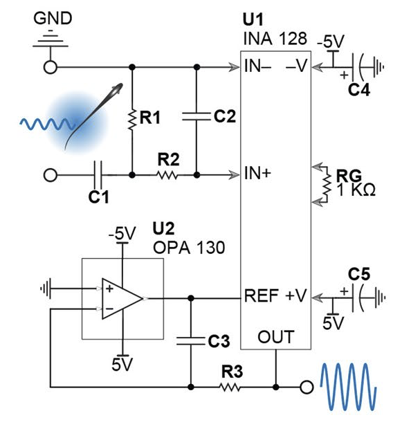
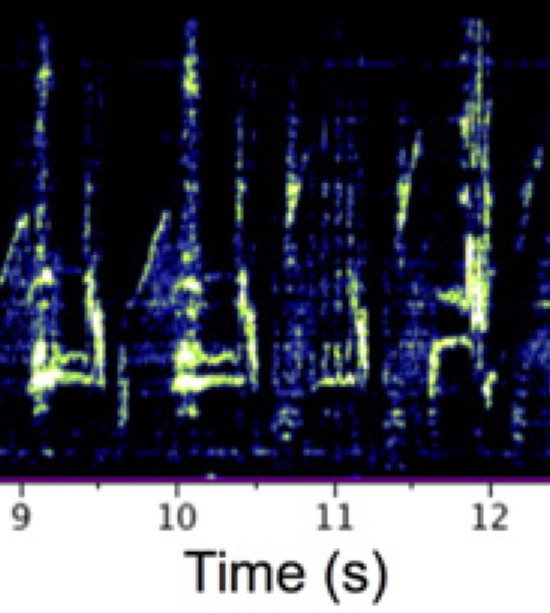
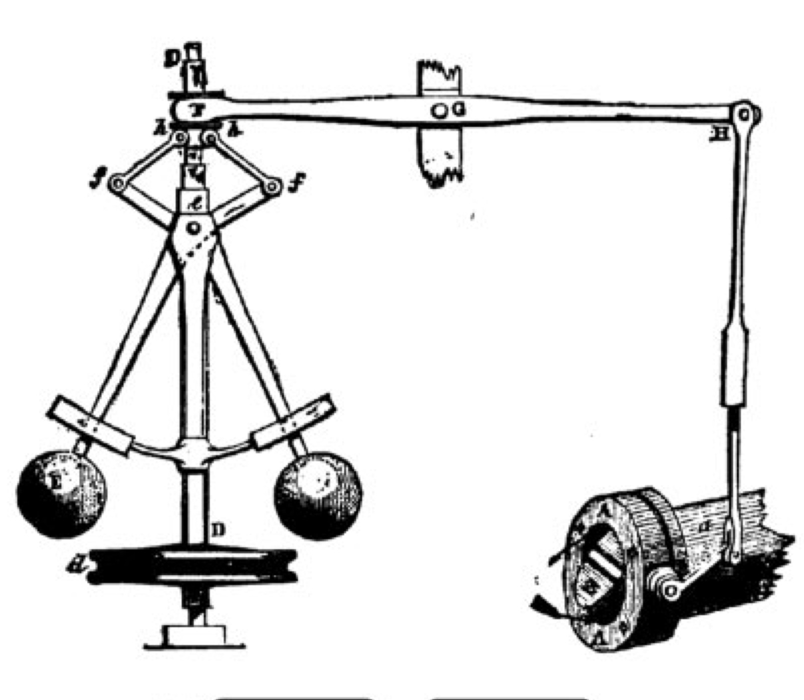

---
---

<link rel="stylesheet" href="styles.css" type="text/css">

<table columns=2 cellspacing=2 cellpadding=5 border=0 width=100%>
<tr><td colspan=1 width=100>

</td><td valign="middle">
Madhav, M.S., Jayakumar R.P., Demir, A., Stamper S.A., Fortune, E.S., and
Cowan N.J. (2018) High-resolution behavioral mapping of electrical fishes in
Amazonian habitats. Scientific Reports. 
[link](url/"https://www.nature.com/articles/s41598-018-24035-5"), 
[PMID:12341234](pdf/MadhavHigh-Resolution2018.pdf).
</td></tr></table>

<table columns=2 cellspacing=2 cellpadding=5 border=0 width=100%>
<tr><td colspan=1 width=100>

</td><td valign="middle">
Rouse, M.L., Stevenson, T.J., Fortune, E.S., and G.F. Ball (2015) Reproductive
state modulates testosterone-induced singing in adult female European starlings
(<i>Sturnus vulgaris</i>).  Horm. Behav., 72:78-87, [PMID:25989596](pdf/RouseReproductive2015.pdf).  
</td></tr></table>

<table columns=2 cellspacing=2 cellpadding=5 border=0 width=100%>
<tr><td colspan=1 width=100>

</td><td valign="middle">
Cowan, N.J., Ankarali, M.M., Dyhr, J.P., Madhav, M.S., Roth, E., Sefati, S.,
Stamper, S.A., Fortune, E.S., and T.L. Daniel (2014) Feedback control as 
a framework for understanding tradeoffs in biology.  Integr. Comp. Biol., 
54:223-237, [PMID:23893678](pdf/CowanFeedback2014.pdf).  
</td></tr></table>

