---
---

<link rel="stylesheet" href="styles.css" type="text/css">

<strong>Journal Publications</strong>

<!-- UYANIK SENSORY 2019 -->
<table columns=2 cellspacing=2 cellpadding=5 border=0 width=100%>
<tr><td colspan=1 width=100>
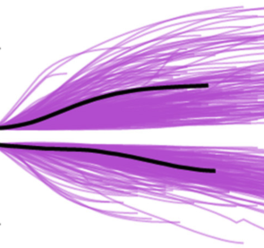
</td><td valign="middle">
Uyanik, I., Stamper, S.A., Cowan, N.J., and E.S. Fortune (2019) Sensory Cues Modulate Smooth Pursuit and Active Sensing Movements. Front. Behav. Neurosci., 
[link](https://www.frontiersin.org/articles/10.3389/fnbeh.2019.00059/full), 
[PMID:31024269](pdf/UyanikSensory2019).
</td></tr></table>

<!-- BISWAS CLOSED-LOOP 2018 -->
<table columns=2 cellspacing=2 cellpadding=5 border=0 width=100%>
<tr><td colspan=1 width=100>
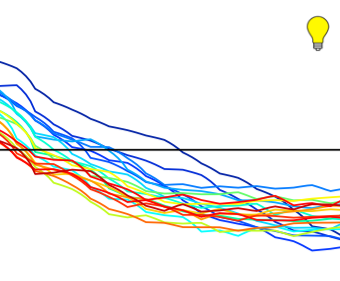
</td><td valign="middle">
Biswas, D., Arend, L.A., Stamper, S.A., Vagvolgyi, B.P., Fortune, E.S., and N.J. Cowan. (2018) Closed-Loop Control of Active Sensing Movements Regulates Sensory Slip. Curr. Biol., 28(24):4029-4036.e4, 
[PMID:30503617](pdf/BiswasClosed-Loop2018.pdf).
</td></tr></table>

<!-- COLEMAN QUICK 2018 -->
<table columns=2 cellspacing=2 cellpadding=5 border=0 width=100%>
<tr><td colspan=1 width=100>
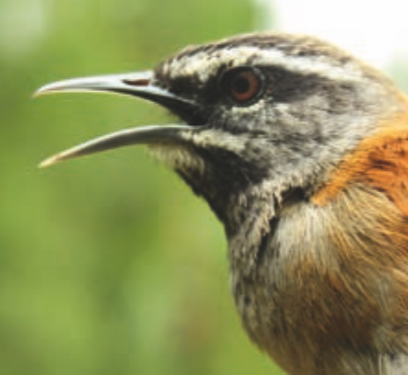
</td><td valign="middle">
Coleman, M.J. and E.S. Fortune (2018) Quick Guide: Duet Singing in plain-tailed wrens. Curr. Biol., 
[doi.org/10.1016/j.cub.2018.02.066](pdf/ColemanQuick2018.pdf).
</td></tr></table>

<!-- MADHAV HIGH-RESOLUTION 2018 -->
<table columns=2 cellspacing=2 cellpadding=5 border=0 width=100%>
<tr><td colspan=1 width=100>

</td><td valign="middle">
Madhav, M.S., Jayakumar R.P., Demir, A., Stamper S.A., Fortune, E.S., and
N.J. Cowan (2018) High-resolution behavioral mapping of electrical fishes in
Amazonian habitats. Scientific Reports. 
[link](https://www.nature.com/articles/s41598-018-24035-5), 
[PMID:29643472](pdf/MadhavHigh-Resolution2018.pdf).
</td></tr></table>

<!-- SUTTON DYNAMIC 2016 -->
<table columns=2 cellspacing=2 cellpadding=5 border=0 width=100%>
<tr><td colspan=1 width=100>
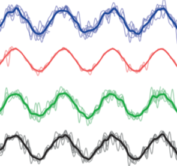
</td><td valign="middle">
Sutton, E.E., Demir, A., Stamper, S.A., Fortune, E.S., and N.J. Cowan (2016) Dynamic modulation of visual and electrosensory gains for locomotor control. J R Soc Interface. 13(118).pii:20160057, [PMID:27170650](pdf/RouseReproductive2015.pdf).  
</td></tr></table>

<!-- ROUSE REPRODUCTIVE 2015 -->
<table columns=2 cellspacing=2 cellpadding=5 border=0 width=100%>
<tr><td colspan=1 width=100>

</td><td valign="middle">
Rouse, M.L., Stevenson, T.J., Fortune, E.S., and G.F. Ball (2015) Reproductive
state modulates testosterone-induced singing in adult female European starlings
(<i>Sturnus vulgaris</i>).  Horm. Behav., 72:78-87, [PMID:25989596](pdf/RouseReproductive2015.pdf).  
</td></tr></table>

<!-- COWAN FEEDBACK 2014 -->
<table columns=2 cellspacing=2 cellpadding=5 border=0 width=100%>
<tr><td colspan=1 width=100>

</td><td valign="middle">
Cowan, N.J., Ankarali, M.M., Dyhr, J.P., Madhav, M.S., Roth, E., Sefati, S.,
Stamper, S.A., Fortune, E.S., and T.L. Daniel (2014) Feedback control as 
a framework for understanding tradeoffs in biology.  Integr. Comp. Biol., 
54:223-237, [PMID:23893678](pdf/CowanFeedback2014.pdf).  
</td></tr></table>

<!-- SEFATI MUTUALLY 2013 -->
<table columns=2 cellspacing=2 cellpadding=5 border=0 width=100%>
<tr><td colspan=1 width=100>

</td><td valign="middle">
Sefati, S., Neveln I.D., Roth E., Mitchell T.R., Snyder J.B., Maciver M.A., Fortune E.S., and N.J. Cowan (2013) Mutually opposing forces during locomotion can eliminate the tradeoff between maneuverability and stability.
PNAS, 110:19798-18803, [PMID:24191034](pdf/SefatiMutually2013_pmid24191034.pdf).  
</td></tr></table>

<!-- MADHAV JAR 2013 -->
<table columns=2 cellspacing=2 cellpadding=5 border=0 width=100%>
<tr><td colspan=1 width=100>

</td><td valign="middle">
Madhav M.S., Stamper, S.A., Fortune, E.S., and N.J. Cowan (2013) Closed-loop stabilization of the Jamming Avoidance Response reveals its locally unstable and globally nonlinear dynamics., J. Exp. Biol., 216:4272-4284, [PMID:23997196](pdf/MadhavClosed2013_pmid23997196.pdf).  
</td></tr></table>

<!-- STAMPER ENVELOPE REVIEW 2013 -->
<table columns=2 cellspacing=2 cellpadding=5 border=0 width=100%>
<tr><td colspan=1 width=100>

</td><td valign="middle">
Stamper, S.A., Fortune, E.S., and M.J. Chacron (2013) Perception and coding of envelopes in weakly electric fishes. J. Exp. Biol., 216:2393-2402, [PMID:23761464](pdf/StamperPerception2013_pmid23761464.pdf).  
</td></tr></table>

<!-- STAMPER BEYOND 2012 -->
<table columns=2 cellspacing=2 cellpadding=5 border=0 width=100%>
<tr><td colspan=1 width=100>

</td><td valign="middle">
Stamper S.A., Madhav M.S., Cowan N.J., and Fortune E.S. (2012) Beyond the Jamming Avoidance Response: weakly electric fish respond to the envelope of social electrosensory signals, J. Exp. Biol., 215:4196-4207,
 [PMID:23136154](pdf/StamperBeyond2012_pmid23136154.pdf).  
</td></tr></table>

<!-- McGILLIVRAY PARALLEL 2012 -->
<table columns=2 cellspacing=2 cellpadding=5 border=0 width=100%>
<tr><td colspan=1 width=100>

</td><td valign="middle">
McGilligray, P., Vonderschen, K., Fortune, E.S., and M.J. Chacron (2012) Parallel coding of first- and second-order stimulusattributes by midbrain electrosensory neurons. J. Neurosci., 32:5510-5524,
 [PMID:22514313](pdf/McGillivrayParallel2012_pmid22514313.pdf).  
</td></tr></table>

<!-- STAMPER ACTIVE 2012 -->
<table columns=2 cellspacing=2 cellpadding=5 border=0 width=100%>
<tr><td colspan=1 width=100>

</td><td valign="middle"> 
Stamper, S.A., Roth, E., Cowan, N.J., and E.S. Fortune (2012) Active sensing via movement shapes spatiotemporal patterns of sensory feedback. J. Exp. Biol., 215:1567-1574,
 [PMID:22496294](pdf/StamperActive2012_pmid22496294.pdf).  
</td></tr></table>

<!-- FORTUNE NEURAL 2011 -->
<table columns=2 cellspacing=2 cellpadding=5 border=0 width=100%>
<tr><td colspan=1 width=100>

</td><td valign="middle"> 
Fortune, E.S., Rodriguez, C., Li, D., Ball, G.F., and M.J. Coleman (2011) Neural mechanisms for the coordination of duet singing in wrens. Science., 334:666-669,
 [PMID:22052048](pdf/FortuneNeural2011_pmid22053048.pdf).  
</td></tr></table>

<!-- ROTH STIMULUS 2011 -->
<table columns=2 cellspacing=2 cellpadding=5 border=0 width=100%>
<tr><td colspan=1 width=100>

</td><td valign="middle"> 
Roth, E., Zhuang, K., Stamper, S.A., Fortune, E.S., and N.J. Cowan 
(2011) Stimulus predictability mediates a switch in locomotor 
smooth pursuit performance for <i>Eigenmannia virescens</i>.,
 [PMID:21389203](pdf/RothStimulus2011_pmid21389203.pdf).  
</td></tr></table>

<!-- KHOSRAVI BURSTS 2011 -->
<table columns=2 cellspacing=2 cellpadding=5 border=0 width=100%>
<tr><td colspan=1 width=100>

</td><td valign="middle"> 
Khosravi-Hashemi, N., Fortune, E.S., and M.J. Chacron
(2011) Coding movement direction by burst firing in electrosensory neurons.,
 [PMID:21775723](pdf/KhosraviCoding2011_pmid21775723.pdf).  
</td></tr></table>

<!-- CHACRON SUBTHRESHOLD 2010 -->
<table columns=2 cellspacing=2 cellpadding=5 border=0 width=100%>
<tr><td colspan=1 width=100>
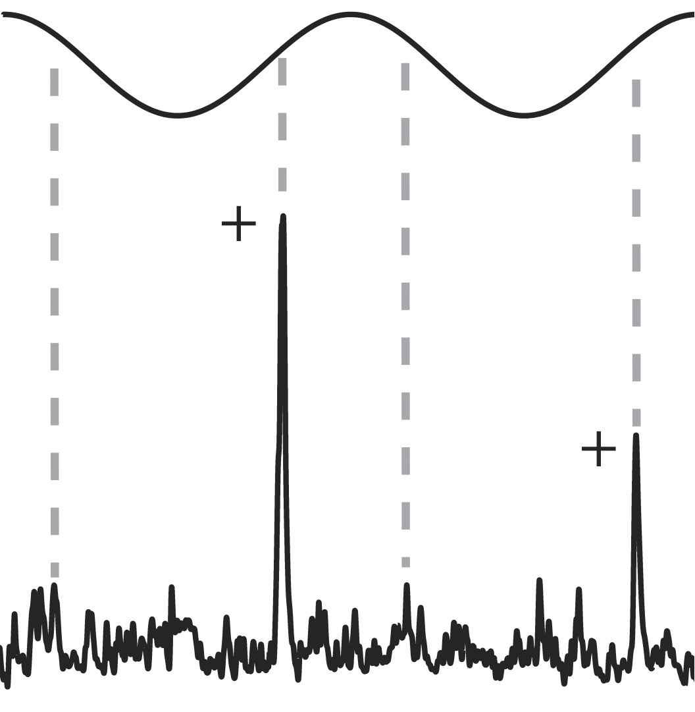
</td><td valign="middle"> 
Chacron, M.J. and E.S. Fortune (2010) Subthreshold membrane
conductances enhance directional selectivity in vertebrate sensory neurons.  J.
Neurophysiol., 4(2):e32, 
 [PMID:20445028](pdf/ChacronSubthreshold2010_pmid20445028.pdf).  
</td></tr></table>

<!-- STAMPER SPECIES 2010 -->
<table columns=2 cellspacing=2 cellpadding=5 border=0 width=100%>
<tr><td colspan=1 width=100>

</td><td valign="middle"> 
Stamper, S.A., Carrera-G, E., Tan, E.W., Fugere, V., Krahe, R., and
E.S.  Fortune (2010) Species differences in group size and electrosensory
interference in weakly electric fishes: Implications for electrosensory
processing. Behav Brain Res., 
 [PMID:19874855](pdf/StamperSpecies2010_pmid19874885.pdf).  
</td></tr></table>

<!-- CHACRON DIFFERENCES 2009 -->
<table columns=2 cellspacing=2 cellpadding=5 border=0 width=100%>
<tr><td colspan=1 width=100>

</td><td valign="middle"> 
Chacron, M.J., Toporikova, N., and E.S. Fortune (2009) Differences
in the time course of short-term depression across receptive fields are
correlated with directional selectivity in electrosensory neurons., J.
Neurophysiol., 102:3270-3279,
 [PMID:19793877](pdf/ChacronDifferences2009_pmid19793877.pdf).  
</td></tr></table>

<!-- HITSFELD EFFECTS 2009 -->
<table columns=2 cellspacing=2 cellpadding=5 border=0 width=100%>
<tr><td colspan=1 width=100>

</td><td valign="middle"> 
Hitschfeld, &Eacute;.M., Stamper, S.A., Vonderschen, K., Fortune,
E.S., and M.J. Chacron (2009) Effects of restraint and immobilization on
electrosensory behavior of weakly electric fish.  ILAR J., 50:361-372,
 [PMID:19949252](pdf/HitschfeldEffects2009_pmid19949252.pdf).  
</td></tr></table>

<!-- FORTUNE MOLECULES 2009 -->
<table columns=2 cellspacing=2 cellpadding=5 border=0 width=100%>
<tr><td colspan=1 width=100>

</td><td valign="middle"> 
Fortune, E.S. and M.J. Chacron (2009) From molecules to behavior:
organismal-level regulation of ion channel trafficking. PLoS Biol., 7:e1000211,
[link](https://journals.plos.org/plosbiology/article?id=10.1371/journal.pbio.1000211),
[PMID:19787034](pdf/FortuneMolecules2009_pmid19787034.pdf).  
</td></tr></table>

<!-- CARVER SYNAPTIC 2008 -->
<table columns=2 cellspacing=2 cellpadding=5 border=0 width=100%>
<tr><td colspan=1 width=100>
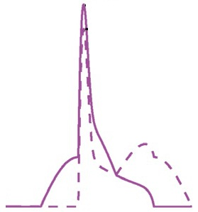
</td><td valign="middle"> 
Carver, S., Roth, E., Cowan, N.J. and E.S. Fortune
(2008) Synaptic plasticity can produce and enhance direction selectivity.  PLoS
Comput. Biol., 4(2):e32,
[link](https://journals.plos.org/ploscompbiol/article?id=10.1371/journal.pcbi.0040032),
[PMID:18282087](pdf/CarverSynaptic2008_pmid18282087.pdf).  
</td></tr></table>

<!-- COWAN CRITICAL 2007 -->
<table columns=2 cellspacing=2 cellpadding=5 border=0 width=100%>
<tr><td colspan=1 width=100>

</td><td valign="middle"> 
Cowan, N.J. and E.S. Fortune (2007) The critical role of locomotion mechanics
in decoding sensory systems. J. Neurosci, 27:1123-1128,
[PMID:17267567](pdf/CowanCritical2007_pmid17267567.pdf).  
</td></tr></table>

<!-- FORTUNE DECODING 2006 -->
<table columns=2 cellspacing=2 cellpadding=5 border=0 width=100%>
<tr><td colspan=1 width=100>
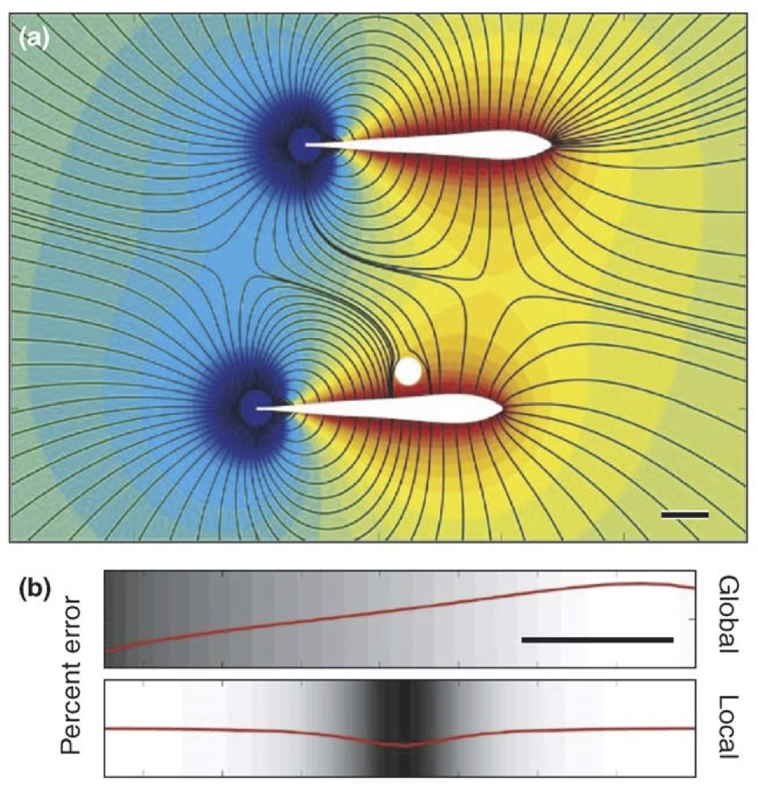
</td><td valign="middle"> 
Fortune, E.S. (2006) The decoding of electrosensory
systems.  Curr. Opin. Neurobiol.,
[PMID:16837187](pdf/FortuneDecoding2006_pmid16837187.pdf).  
</td></tr></table>

<!-- RAMCHARITAR GLOBAL 2006 -->
<table columns=2 cellspacing=2 cellpadding=5 border=0 width=100%>
<tr><td colspan=1 width=100>
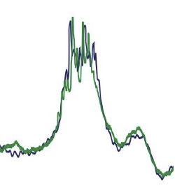
</td><td valign="middle"> 
Ramcharitar, J.U., Tan, E.W., E.S. Fortune (2006) Global
electrosensory oscillations enhance directional responses of midbrain neurons
in <i>Eigenmannia</i>. J. Neurophys.,
[PMID:16790600](pdf/RamcharitarGlobal2006_pmid16790600.pdf).  
</td></tr></table>

<!-- FORTUNE ENCODING 2006 -->
<table columns=2 cellspacing=2 cellpadding=5 border=0 width=100%>
<tr><td colspan=1 width=100>

</td><td valign="middle"> 
Fortune, E.S., Rose, G.J., and M. Kawasaki (2006)
Encoding and processing biologically relevant temporal information in
electrosensory systems.  J. Comp. Physiol. A, 192:625-635,
[PMID:16450118](pdf/FortuneEncoding2006_pmid16450118.pdf).  
</td></tr></table>

<!-- RAMCHARITAR EFFECTS 2005 -->
<table columns=2 cellspacing=2 cellpadding=5 border=0 width=100%>
<tr><td colspan=1 width=100>

</td><td valign="middle"> 
Ramcharitar, J.U., Tan, E.W., and E.S. Fortune (2005)  
Effects of global electrosensory signals on motion processing in the midbrain
of <i>Eigenmannia</i>.  J. Comp. Physiol. A, 191:865-872,
[PMID:16001182](pdf/RamcharitarEffects2005_pmid16001182.pdf).  
</td></tr></table>

<!-- TAN ELECTROSENSORY 2005 -->
<table columns=2 cellspacing=2 cellpadding=5 border=0 width=100%>
<tr><td colspan=1 width=100>
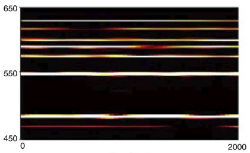
</td><td valign="middle"> 
Tan, E.W., Nizar, J.M., Carrera-G, E., and E.S. Fortune
(2005)  Electrosensory interference in naturally occurring aggregates of a
species of weakly electric fish, <i>Eigenmannia virescens</i>. Behav. Brain
Res., 164:83-92,
[PMID:16099058](pdf/TanElectrosensory2005_pmid16099058.pdf).  
</td></tr></table>

<!-- FORTUNE VOLTAGE 2003 -->
<table columns=2 cellspacing=2 cellpadding=5 border=0 width=100%>
<tr><td colspan=1 width=100>

</td><td valign="middle"> 
Fortune, E.S. and G.J. Rose (2003)  Voltage-gated
Na+ channels enhance the temporal filtering properties of
electrosensory neurons in the torus. J. Neurophys., 90:924-929,
[PMID:12750421](pdf/FortuneVoltage2003_pmid12750421.pdf).  
</td></tr></table>

<!-- FORTUNE ROLES 2002 -->
<table columns=2 cellspacing=2 cellpadding=5 border=0 width=100%>
<tr><td colspan=1 width=100>
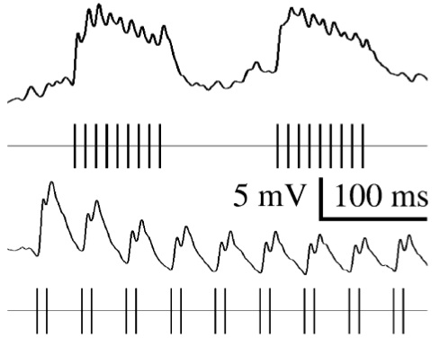
</td><td valign="middle"> 
Fortune, E.S. and G.J. Rose (2002)  Roles for short-term
synaptic plasticity in behavior. J Physiol Paris, 96:539-545,
[PMID:14692501](pdf/FortuneRoles2002_pmid14692501.pdf).  
</td></tr></table>

<!-- FORTUNE TINS 2001 -->
<table columns=2 cellspacing=2 cellpadding=5 border=0 width=100%>
<tr><td colspan=1 width=100>

</td><td valign="middle"> 
Fortune, E.S. and G.J. Rose (2001)  Short-term
synaptic plasticity as a temporal filter. Trends in Neurosciences,
24:381-385,
[PMID:11410267](pdf/FortuneShort2001_pmid11410267.pdf).  
</td></tr></table>

<!-- ROSE FREQUENCY-DEPENDENT 1999 -->
<table columns=2 cellspacing=2 cellpadding=5 border=0 width=100%>
<tr><td colspan=1 width=100>
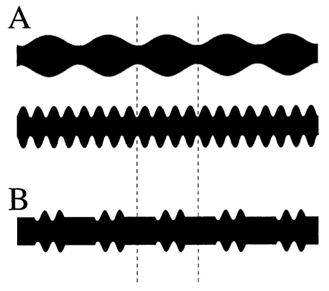
</td><td valign="middle"> 
Rose, G.J. and E.S. Fortune (1999)
Frequency-dependent PSP depression contributes to low-pass temporal
filtering in <i>Eigenmannia</i>.  J. Neurosci., 19:7629-7639,
[PMID:10460268](pdf/RoseFrequency1999_pmid10460268.pdf).  
</td></tr></table>

<!-- ROSE MECHANISMS 1999 -->
<table columns=2 cellspacing=2 cellpadding=5 border=0 width=100%>
<tr><td colspan=1 width=100>

</td><td valign="middle"> 
Rose, G.J. and E.S. Fortune (1999) Mechanisms for
generating temporal filters in the electrosensory system.  J. Exp.
Biol., 202:1281-1289,
[PMID:10210668](pdf/RoseMechanisms1999_pmid10210668.pdf).  
</td></tr></table>

<!-- FORTUNE PASSIVE 1997 -->
<table columns=2 cellspacing=2 cellpadding=5 border=0 width=100%>
<tr><td colspan=1 width=100>

</td><td valign="middle"> 
Fortune, E.S. and G.J. Rose (1997) Passive and
active membrane properties contribute to the temporal filtering
properties of midbrain neurons, <i>in vivo</i>. J. Neurosci.,
17:3815-3825,
[PMID:9133400](pdf/FortunePassive1997_pmid9133400.pdf).  
</td></tr></table>

<!-- FORTUNE TEMPORAL 1997 -->
<table columns=2 cellspacing=2 cellpadding=5 border=0 width=100%>
<tr><td colspan=1 width=100>
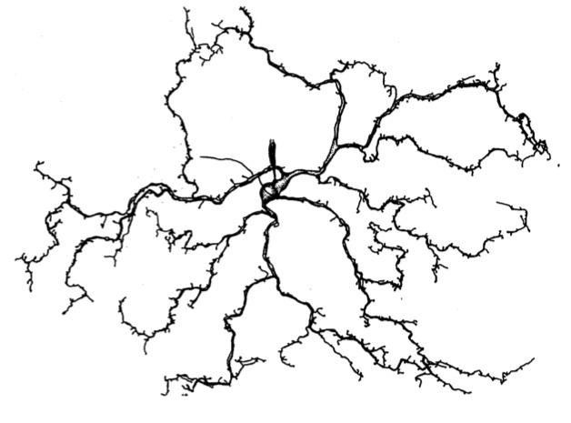
</td><td valign="middle"> 
Fortune, E.S. and G.J. Rose (1997) Temporal
filtering properties of ampullary electrosensory neurons in the torus
semicircularis of <i>Eigenmannia</i>: evolutionary and computational
implications.  Brain, Behav., and Evol., 49:312-323,
[PMID:9167857](pdf/FortuneTemporal1997_pmid9167857.pdf).  
</td></tr></table>

<!-- ROSE NEW 1996 -->
<table columns=2 cellspacing=2 cellpadding=5 border=0 width=100%>
<tr><td colspan=1 width=100>

</td><td valign="middle"> 
Rose, G.J. and E.S. Fortune (1996) New techniques
for making whole-cell recordings from CNS neurons <i>in vivo</i>. 
Neurosci. Res. 26:89-94,
[PMID:8895897](pdf/RoseNew1996_pmid8895897.pdf).  
</td></tr></table>

<!-- FORTUNE PARALLEL 1995 -->
<table columns=2 cellspacing=2 cellpadding=5 border=0 width=100%>
<tr><td colspan=1 width=100>

</td><td valign="middle"> 
Fortune, E.S. and D. Margoliash (1995) Parallel
pathways and convergence onto HVc and adjacent neostriatum of adult
male zebra finches (<i>Taeniopygia guttata</i>). J. Comp. Neurol. 360(3):413-441,
[PMID:8543649](pdf/FortuneParallel1995_pmid8543649.pdf).  
</td></tr></table>

<!-- MARGOLIASH DISTRIBUTED 1994 -->
<table columns=2 cellspacing=2 cellpadding=5 border=0 width=100%>
<tr><td colspan=1 width=100>

</td><td valign="middle"> 
Margoliash, D., E.S. Fortune, M. Sutter, C-H. Yu,
D. Hardin, and A.Dave (1994) Distributed representation in the song
system of oscines: evolutionary implications and functional consequences.
Brain Behav. Evol. 44:247-264, 
[PMID:7842284](pdf/MargoliashDistributed1994_pmid7842284.pdf).  
</td></tr></table>

<!-- FORTUNE CYTOARCHITECTONIC 1992 -->
<table columns=2 cellspacing=2 cellpadding=5 border=0 width=100%>
<tr><td colspan=1 width=100>
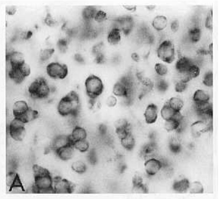
</td><td valign="middle"> 
Fortune, E.S. and D. Margoliash (1992)
Cytoarchitectonic organization and morphology of cells of the field L
complex in adult male zebra finches (<i>Taeniopygia guttata</i>).  J. Comp.
Neurol., 325:388-404,
[PMID:1447407](pdf/FortuneCytoarchitectonic1992_pmid1447407.pdf).  
</td></tr></table>

<!-- MARGOLIASH TEMPORAL 1992 -->
<table columns=2 cellspacing=2 cellpadding=5 border=0 width=100%>
<tr><td colspan=1 width=100>

</td><td valign="middle"> 
Margoliash, D. and E.S. Fortune (1992) Temporal
and harmonic combination-sensitive neurons in the zebra finch's HVc. 
J. Neurosci., 12:4309-4326,
[PMID:1432096](pdf/MargoliashTemporal1992_pmid1432096.pdf).  
</td></tr></table>

