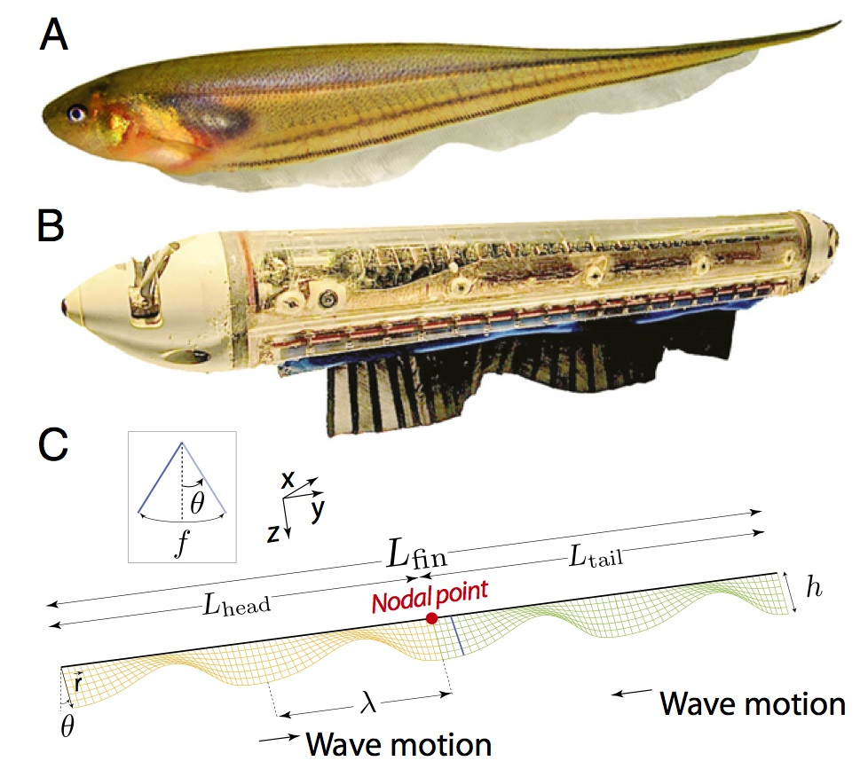
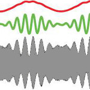
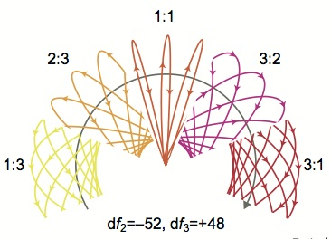
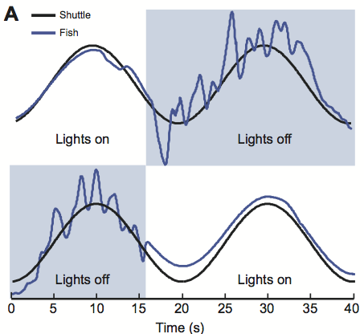
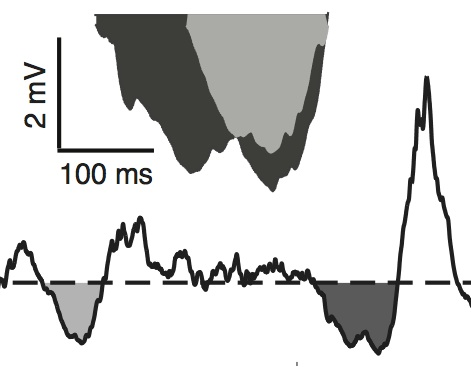
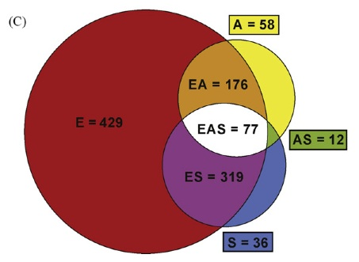
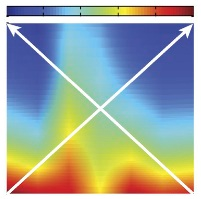

---
---

<link rel="stylesheet" href="styles.css" type="text/css">

<strong>Peer-Reviewed Publications</strong>

<!-- UYANIK SENSORY 2019 -->
<table columns=2 cellspacing=2 cellpadding=5 border=0 width=100%>
<tr><td colspan=1 width=100>

</td><td valign="middle">
Uyanik, I., Stamper, S.A., Cowan, N.J., and E.S. Fortune (2019) Sensory Cues Modulate Smooth Pursuit and Active Sensing Movements. Front. Behav. Neurosci., 
[link](https://www.frontiersin.org/articles/10.3389/fnbeh.2019.00059/full), 
[PMID:31024269](pdf/UyanikSensory2019).
</td></tr></table>

<!-- BISWAS CLOSED-LOOP 2018 -->
<table columns=2 cellspacing=2 cellpadding=5 border=0 width=100%>
<tr><td colspan=1 width=100>

</td><td valign="middle">
Biswas, D., Arend, L.A., Stamper, S.A., Vagvolgyi, B.P., Fortune, E.S., and N.J. Cowan. (2018) Closed-Loop Control of Active Sensing Movements Regulates Sensory Slip. Curr. Biol., 28(24):4029-4036.e4, 
[PMID:30503617](pdf/BiswasClosed-Loop2018.pdf).
</td></tr></table>

<!-- MADHAV HIGH-RESOLUTION 2018 -->
<table columns=2 cellspacing=2 cellpadding=5 border=0 width=100%>
<tr><td colspan=1 width=100>

</td><td valign="middle">
Madhav, M.S., Jayakumar R.P., Demir, A., Stamper S.A., Fortune, E.S., and
N.J. Cowan (2018) High-resolution behavioral mapping of electrical fishes in
Amazonian habitats. Scientific Reports. 
[link](https://www.nature.com/articles/s41598-018-24035-5), 
[PMID:29643472](pdf/MadhavHigh-Resolution2018.pdf).
</td></tr></table>

<!-- SUTTON DYNAMIC 2016 -->
<table columns=2 cellspacing=2 cellpadding=5 border=0 width=100%>
<tr><td colspan=1 width=100>

</td><td valign="middle">
Sutton, E.E., Demir, A., Stamper, S.A., Fortune, E.S., and N.J. Cowan (2016) Dynamic modulation of visual and electrosensory gains for locomotor control. J R Soc Interface. 13(118).pii:20160057, [PMID:27170650](pdf/RouseReproductive2015.pdf).  
</td></tr></table>

<!-- ROUSE REPRODUCTIVE 2015 -->
<table columns=2 cellspacing=2 cellpadding=5 border=0 width=100%>
<tr><td colspan=1 width=100>

</td><td valign="middle">
Rouse, M.L., Stevenson, T.J., Fortune, E.S., and G.F. Ball (2015) Reproductive
state modulates testosterone-induced singing in adult female European starlings
(<i>Sturnus vulgaris</i>).  Horm. Behav., 72:78-87, [PMID:25989596](pdf/RouseReproductive2015.pdf).  
</td></tr></table>

<!-- COWAN FEEDBACK 2014 -->
<table columns=2 cellspacing=2 cellpadding=5 border=0 width=100%>
<tr><td colspan=1 width=100>

</td><td valign="middle">
Cowan, N.J., Ankarali, M.M., Dyhr, J.P., Madhav, M.S., Roth, E., Sefati, S.,
Stamper, S.A., Fortune, E.S., and T.L. Daniel (2014) Feedback control as 
a framework for understanding tradeoffs in biology.  Integr. Comp. Biol., 
54:223-237, [PMID:23893678](pdf/CowanFeedback2014.pdf).  
</td></tr></table>

<!-- SEFATI MUTUALLY 2013 -->
<table columns=2 cellspacing=2 cellpadding=5 border=0 width=100%>
<tr><td colspan=1 width=100>

</td><td valign="middle">
Sefati, S., Neveln I.D., Roth E., Mitchell T.R., Snyder J.B., Maciver M.A., Fortune E.S., and N.J. Cowan (2013) Mutually opposing forces during locomotion can eliminate the tradeoff between maneuverability and stability.
PNAS, 110:19798-18803, [PMID:24191034](pdf/SefatiMutually2013_pmid24191034.pdf).  
</td></tr></table>

<!-- MADHAV JAR 2013 -->
<table columns=2 cellspacing=2 cellpadding=5 border=0 width=100%>
<tr><td colspan=1 width=100>

</td><td valign="middle">
Madhav M.S., Stamper, S.A., Fortune, E.S., and N.J. Cowan (2013) Closed-loop stabilization of the Jamming Avoidance Response reveals its locally unstable and globally nonlinear dynamics., J. Exp. Biol., 216:4272-4284, [PMID:23997196](pdf/MadhavClosed2013_pmid23997196.pdf).  
</td></tr></table>

<!-- STAMPER ENVELOPE REVIEW 2013 -->
<table columns=2 cellspacing=2 cellpadding=5 border=0 width=100%>
<tr><td colspan=1 width=100>

</td><td valign="middle">
Stamper, S.A., Fortune, E.S., and M.J. Chacron (2013) Perception and coding of envelopes in weakly electric fishes. J. Exp. Biol., 216:2393-2402, [PMID:23761464](pdf/StamperPerception2013_pmid23761464.pdf).  
</td></tr></table>

<!-- STAMPER BEYOND 2012 -->
<table columns=2 cellspacing=2 cellpadding=5 border=0 width=100%>
<tr><td colspan=1 width=100>

</td><td valign="middle">
Stamper S.A., Madhav M.S., Cowan N.J., and Fortune E.S. (2012) Beyond the Jamming Avoidance Response: weakly electric fish respond to the envelope of social electrosensory signals, J. Exp. Biol., 215:4196-4207,
 [PMID:23136154](pdf/StamperBeyond2012_pmid23136154.pdf).  
</td></tr></table>

<!-- McGILLIVRAY PARALLEL 2012 -->
<table columns=2 cellspacing=2 cellpadding=5 border=0 width=100%>
<tr><td colspan=1 width=100>

</td><td valign="middle">
McGilligray, P., Vonderschen, K., Fortune, E.S., and M.J. Chacron (2012) Parallel coding of first- and second-order stimulusattributes by midbrain electrosensory neurons. J. Neurosci., 32:5510-5524,
 [PMID:22514313](pdf/McGillivrayParallel2012_pmid22514313.pdf).  
</td></tr></table>

<!-- STAMPER ACTIVE 2012 -->
<table columns=2 cellspacing=2 cellpadding=5 border=0 width=100%>
<tr><td colspan=1 width=100>

</td><td valign="middle"> 
Stamper, S.A., Roth, E., Cowan, N.J., and E.S. Fortune (2012) Active sensing via movement shapes spatiotemporal patterns of sensory feedback. J. Exp. Biol., 215:1567-1574,
 [PMID:22496294](pdf/StamperActive2012_pmid22496294.pdf).  
</td></tr></table>

<!-- FORTUNE NEURAL 2011 -->
<table columns=2 cellspacing=2 cellpadding=5 border=0 width=100%>
<tr><td colspan=1 width=100>

</td><td valign="middle"> 
Fortune, E.S., Rodriguez, C., Li, D., Ball, G.F., and M.J. Coleman (2011) Neural mechanisms for the coordination of duet singing in wrens. Science., 334:666-669,
 [PMID:22052048](pdf/FortuneNeural2011_pmid22053048.pdf).  
</td></tr></table>

<!-- ROTH STIMULUS 2011 -->
<table columns=2 cellspacing=2 cellpadding=5 border=0 width=100%>
<tr><td colspan=1 width=100>

</td><td valign="middle"> 
Roth, E., Zhuang, K., Stamper, S.A., Fortune, E.S., and N.J. Cowan 
(2011) Stimulus predictability mediates a switch in locomotor 
smooth pursuit performance for <i>Eigenmannia virescens</i>.,
 [PMID:21389203](pdf/RothStimulus2011_pmid21389203.pdf).  
</td></tr></table>

<!-- KHOSRAVI BURSTS 2011 -->
<table columns=2 cellspacing=2 cellpadding=5 border=0 width=100%>
<tr><td colspan=1 width=100>

</td><td valign="middle"> 
Khosravi-Hashemi, N., Fortune, E.S., and M.J. Chacron
(2011) Coding movement direction by burst firing in electrosensory neurons.,
 [PMID:21775723](pdf/KhosraviCoding2011_pmid21775723.pdf).  
</td></tr></table>

<!-- CHACRON SUBTHRESHOLD 2010 -->
<table columns=2 cellspacing=2 cellpadding=5 border=0 width=100%>
<tr><td colspan=1 width=100>

</td><td valign="middle"> 
Chacron, M.J. and E.S. Fortune (2010) Subthreshold membrane
conductances enhance directional selectivity in vertebrate sensory neurons.  J.
Neurophysiol., 4(2):e32, 
 [PMID:20445028](pdf/ChacronSubthreshold2010_pmid20445028.pdf).  
</td></tr></table>

<!-- STAMPER SPECIES 2010 -->
<table columns=2 cellspacing=2 cellpadding=5 border=0 width=100%>
<tr><td colspan=1 width=100>

</td><td valign="middle"> 
Stamper, S.A., Carrera-G, E., Tan, E.W., Fugere, V., Krahe, R., and
E.S.  Fortune (2010) Species differences in group size and electrosensory
interference in weakly electric fishes: Implications for electrosensory
processing. Behav Brain Res., 
 [PMID:19874855](pdf/StamperSpecies2010_pmid19874885.pdf).  
</td></tr></table>

<!-- CHACRON DIFFERENCES 2009 -->
<table columns=2 cellspacing=2 cellpadding=5 border=0 width=100%>
<tr><td colspan=1 width=100>

</td><td valign="middle"> 
Chacron, M.J., Toporikova, N., and E.S. Fortune (2009) Differences
in the time course of short-term depression across receptive fields are
correlated with directional selectivity in electrosensory neurons., J.
Neurophysiol., 102:3270-3279,
 [PMID:19793877](pdf/ChacronDifferences2009_pmid19793877.pdf).  
</td></tr></table>

