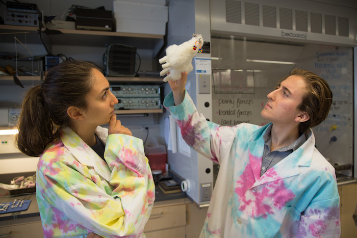
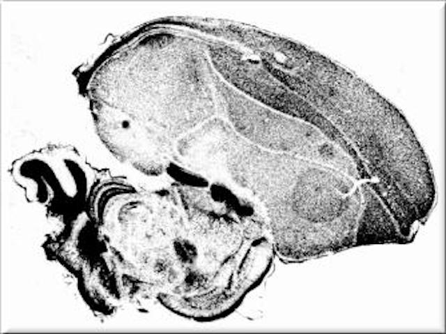
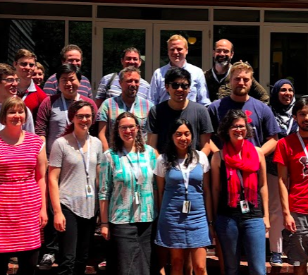

---
---
<link rel="stylesheet" href="styles.css" type="text/css">

<h1 class="display-3" align="center">University courses</h1>

<!-- BIOL200: Concepts in Biology -->
<table align="center" columns=1 cellspacing=2 cellpadding=5 border=0 width=80%>
<tr><td colspan=1 width="80%"" align="center" valign="middle">

</td></tr>
<tr><td valign="middle" align="center">

BIOL200: Concepts in Biology

This lecture course for first-semester undergraduates reviews and introduces current trends in modern biology. Topics include evolution, biomechanics, infectious disease, genetics, and behavioral neuroscience.
 
</td></tr></table>

<!-- BIOL250: Biology of Neotropical Habitats: Ecuador and Galápagos Islands -->
<table align="center" columns=2 cellspacing=2 cellpadding=5 border=0 width=80%>
<tr><td colspan=1 width="80%"" align="center" valign="middle">

</td></tr>
<tr><td valign="middle" align="center">

BIOL250: Biology of Neotropical Habitats: Ecuador and Galápagos Islands

This 14 to 16 day course for undergraduates includes travel to the rainforests and Andean highlands of mainland Ecuador, and a tour of the Gal&aacute;pagos Islands. The course starts with two days of pre-departure lectures on a wide variety of topics. These lectures are designed to help students to recognize the most important biological and other phenomena that they will encounter during their travels.
The remainder of the course is spent traveling in Ecuador. During our travels with knowledgeable guides, we also hear lectures from Ecuadorian professors and other experts.
</td></tr></table>

<!-- BIOL347: Laboratory Approaches in Neuroscience -->
<table align="center" columns=2 cellspacing=2 cellpadding=5 border=0 width=80%>
<tr><td colspan=1 width="80%"" align="center" valign="middle">
</td></tr>
<tr><td valign="middle" align="center">

BIOL347: Laboratory Approaches in Neuroscience

This laboratory course for advanced undergraduates focuses on hands-on experiences for the neurosciences. The course is composed of a suite of neurophysiological exercises, including electrocardiograms, extracellular neurophysiology, and intracellular neurophysiological techniques.
</td></tr></table>

<!-- BIOL698: Cellular and Systems Neuroscience -->
<table align="center" columns=2 cellspacing=2 cellpadding=5 border=0 width=80%>
<tr><td colspan=1 width="80%"" align="center" valign="middle">
</td></tr>
<tr><td valign="middle" align="center">

BIOL698: Cellular and Systems Neuroscience

This course addresses a fundamental question in Neuroscience – how do brains control animal behavior? The goal of the course is to introduce students to the mechanisms, from the level of molecules to complete brain systems, by which animals control their behavior. We will cover fundamental topics in Neuroscience including the structure and organization of animal brains, the functional design of neurons including anatomical and physiological properties, and the functional organization of sensory and motor systems.
</td></tr></table>

<h1 class="display-3" align="center">Other teaching</h1>

<!-- Neuroetología -->
<table align="center" columns=1 cellspacing=2 cellpadding=5 border=0 width=80%>
<tr><td colspan=1 width="80%"" align="center" valign="middle">
</td></tr>
<tr><td valign="middle" align="center">

Neuroetolog&iacute;a, Quito!

This course is held every few years in Quito and includes reviews of the major neuroethological model systems that occur within the country of Ecuador, including bats, owls, weakly electric fishes, songbirds, ants, bees, and other invertebrates. The course includes a 3 day field trip to the cloud forest [Yanayacu Biological Research Station](http://www.yanayacu.org). During this trip students gather behavioral data, design long-term experiments, and conduct neurophysiological recordings. The course includes tutorials on data analysis using R, a free computational platform. Our [2014 Neuroetolog&iacute;a website](https://web.njit.edu/~efortune/n2014/) is still up.

</td></tr></table>

<!-- Neural Systems and Behavior WEF -->
<table align="center" columns=1 cellspacing=2 cellpadding=5 border=0 width=80%>
<tr><td colspan=1 width="80%"" align="center" valign="middle">
</td></tr>
<tr><td valign="middle" align="center">

Neural Systems and Behavior, Weakly Electric Fishes

The [NS&B](http://www.mbl.edu/nsb) course is an intensive 8-week hands-on depp dive into the behavioral neurosciences for graduate students, post-docs, and faculty. The course is divided into four 2-week cycles. Each cycle features 1 to 4 model systems that varies from year to year. Model systems have included leech, stomatogastric ganglia, electric fish, fly flight, chick auditory brainstem, insect social behavior, songbird learning and production, whisking in rodents, learning in cerebellar circuits, and behavioral genetics in C. elegans, mice, and zebra fish. I have been faculty in the course for electric fish and birdsong systems.

</td></tr></table>

